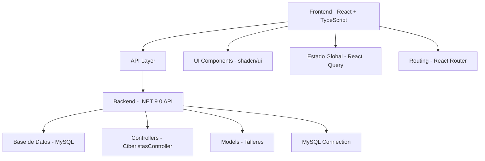

# 🚀 Ciberistas - Plataforma Educativa

> Una plataforma moderna para jóvenes que desean aprender programación, robótica y tecnología de forma divertida e interactiva.


## 📋 Tabla de Contenidos

- [🎯 Características](#-características)
- [🏗️ Arquitectura del Proyecto](#️-arquitectura-del-proyecto)
- [⚡ Tecnologías Utilizadas](#-tecnologías-utilizadas)
- [🚀 Instalación y Configuración](#-instalación-y-configuración)
- [📁 Estructura del Proyecto](#-estructura-del-proyecto)
- [🎨 Diseño y UI/UX](#-diseño-y-uiux)
- [🔧 Scripts Disponibles](#-scripts-disponibles)
- [🌐 API Endpoints](#-api-endpoints)
- [📱 Responsive Design](#-responsive-design)
- [🔒 Seguridad](#-seguridad)
- [🧪 Testing](#-testing)
- [📈 Performance](#-performance)
- [🤝 Contribución](#-contribución)

## 🎯 Características

### ✨ Funcionalidades Principales

- **🎓 Gestión de Talleres**: Sistema completo para crear, editar y gestionar talleres educativos
- **👥 Registro de Participantes**: Formulario multi-paso intuitivo para inscripciones
- **📊 Dashboard Estadístico**: Métricas en tiempo real sobre participantes y talleres
- **🤝 Patrocinadores**: Sección dedicada a mostrar partners y colaboradores
- **📧 Sistema de Contacto**: Formularios de contacto integrados
- **🔄 API RESTful**: Backend robusto con endpoints bien documentados
- **📱 Responsive Design**: Diseño adaptativo para todos los dispositivos
- **🎨 UI Moderna**: Interfaz inspirada en las mejores prácticas de UX/UI

### 🌟 Destacados Técnicos

- **⚡ Performance Optimizada**: Lazy loading, code splitting y optimización de bundles
- **🔒 Seguridad Integrada**: Validación de formularios, sanitización de datos
- **♿ Accesibilidad**: Cumple con estándares WCAG 2.1
- **🌐 SEO Optimizado**: Meta tags, structured data y sitemap
- **📊 Analytics Ready**: Preparado para integración con Google Analytics

## 🏗️ Arquitectura del Proyecto



## ⚡ Tecnologías Utilizadas

### Frontend
- **React 18.3.1** - Biblioteca de UI moderna
- **TypeScript 5.5.3** - Tipado estático para JavaScript
- **Vite** - Build tool ultra-rápido
- **Tailwind CSS 3.4.11** - Framework CSS utility-first
- **shadcn/ui** - Componentes de UI elegantes y accesibles
- **React Query** - Gestión de estado del servidor
- **React Router DOM** - Enrutamiento del lado del cliente
- **React Hook Form** - Gestión eficiente de formularios
- **Zod** - Validación de esquemas TypeScript-first

### Backend
- **.NET 9.0** - Framework web moderno y multiplataforma
- **ASP.NET Core** - APIs RESTful de alto rendimiento
- **MySQL 8.0** - Base de datos relacional robusta
- **Entity Framework** - ORM para .NET
- **CORS** - Cross-Origin Resource Sharing
- **MySql.Data** - Conector nativo para MySQL

### Desarrollo y Herramientas
- **ESLint** - Linting de código
- **Prettier** - Formateo de código
- **Concurrently** - Ejecución paralela de scripts
- **PostCSS** - Procesamiento de CSS
- **Autoprefixer** - Prefijos CSS automáticos

## 🚀 Instalación y Configuración

### Prerrequisitos

- **Node.js** 18+ y **npm/bun**
- **.NET 9.0 SDK**
- **MySQL 8.0** o superior
- **Git**

### 🛠️ Configuración del Entorno

1. **Clonar el repositorio**
```bash
git clone https://github.com/tuusuario/ciberistas.git
cd ciberistas
```

2. **Configurar la Base de Datos MySQL**
```sql
CREATE DATABASE Ciberistas;
USE Ciberistas;

-- Ejecutar el script de creación de tablas
SOURCE backend/setup.sql;

-- Poblar con datos de ejemplo
SOURCE backend/poblate_talleres.sql;
```

3. **Configurar el Backend (.NET)**
```bash
cd backend/ApiCiberistas
dotnet restore
dotnet build
```

4. **Configurar el Frontend (React)**
```bash
cd frontend
npm install
# o si usas bun:
bun install
```

5. **Variables de Entorno**

Crear archivo `.env` en `/frontend`:
```env
VITE_API_URL=http://localhost:5211
```

### 🚦 Ejecutar el Proyecto

**Opción 1: Ejecutar por separado**

Backend (.NET API):
```bash
cd backend/ApiCiberistas
dotnet run
# Servidor corriendo en http://localhost:5211
```

Frontend (React):
```bash
cd frontend
npm run dev
# o con bun:
bun dev
# Aplicación disponible en http://localhost:8080
```

**Opción 2: Ejecutar ambos simultáneamente**
```bash
# Desde la raíz del proyecto
npm run dev
```

### 🔧 Scripts Disponibles

#### Frontend
- `npm run dev` - Servidor de desarrollo con hot reload
- `npm run build` - Build de producción
- `npm run preview` - Vista previa del build
- `npm run lint` - Análisis de código con ESLint

#### Backend
- `dotnet run` - Ejecutar la API en modo desarrollo
- `dotnet build` - Compilar el proyecto
- `dotnet publish` - Crear build de producción

## 📁 Estructura del Proyecto

```
📦 ciberistas/
├── 📂 frontend/                 # Aplicación React + TypeScript
│   ├── 📂 src/
│   │   ├── 📂 components/       # Componentes reutilizables
│   │   │   ├── 📂 ui/           # Componentes base (shadcn/ui)
│   │   │   ├── FeaturesSection.tsx
│   │   │   ├── Hero.tsx
│   │   │   ├── Navbar.tsx
│   │   │   └── WorkshopCard.tsx
│   │   ├── 📂 pages/            # Páginas principales
│   │   │   ├── Index.tsx        # Página de inicio
│   │   │   ├── Workshops.tsx    # Lista de talleres
│   │   │   └── Contacto.tsx     # Página de contacto
│   │   ├── 📂 services/         # Servicios API
│   │   │   └── api.ts           # Cliente API centralizado
│   │   ├── 📂 hooks/            # Custom hooks
│   │   └── 📂 lib/              # Utilidades
│   ├── 📂 public/               # Assets estáticos
│   └── package.json
├── 📂 backend/
│   ├── 📂 ApiCiberistas/        # API .NET 9.0
│   │   ├── 📂 Controllers/
│   │   │   └── CiberistasController.cs  # Controlador principal
│   │   ├── Talleres.cs          # Modelo de datos
│   │   ├── Program.cs           # Configuración de la app
│   │   └── ApiCiberistas.csproj
│   ├── setup.sql                # Script de creación DB
│   └── poblate_talleres.sql     # Datos de ejemplo
└── README.md
```

## 🌐 API Endpoints

### Base URL
```
http://localhost:5211
```

### Talleres/Workshops

| Método | Endpoint | Descripción | Respuesta |
|--------|----------|-------------|-----------|
| `GET` | `/Ciberistas/GetTalleres` | Obtener todos los talleres | Array de talleres |
| `GET` | `/Ciberistas/GetTallerConId/{id}` | Obtener taller por ID | Objeto taller |

### Ejemplo de Respuesta - Talleres
```json
[
  {
    "id_taller": 1,
    "nombre": "Programación Web con HTML y CSS",
    "descripcion": "Aprende a crear páginas web desde cero...",
    "fecha": "2024-02-15T00:00:00",
    "requisitos": "Conocimientos básicos de computación",
    "modalidad": "Presencial",
    "cupo": 25
  }
]
```

### Headers Requeridos
```
Content-Type: application/json
Accept: application/json
```

## 🚀 Despliegue

### Frontend Deployment
- Build el frontend: `npm run build` en el directorio frontend
- Despliega en servicios como Vercel, Netlify, o GitHub Pages
- O sirve con cualquier servicio de hosting estático

### Backend Deployment (.NET)
- Despliega la API .NET a servicios como Azure, AWS, o DigitalOcean
- Configura la cadena de conexión MySQL en `appsettings.json`
- Asegúrate de actualizar la URL de la API en la configuración del frontend (`VITE_API_URL`)

### Configuración de Dominio Personalizado

Para dominios personalizados, configura los ajustes de dominio de tu proveedor de hosting según su documentación.

### Variables de Entorno de Producción

**Frontend (.env.production):**
```env
VITE_API_URL=https://tu-api-backend.com
```

**Backend (appsettings.Production.json):**
```json
{
  "ConnectionStrings": {
    "DefaultConnection": "Server=tu-servidor;Database=Ciberistas;Uid=usuario;Pwd=contraseña;"
  }
}
```

## 🤝 Contribución

1. Fork el proyecto
2. Crea una rama para tu feature (`git checkout -b feature/nueva-funcionalidad`)
3. Commit tus cambios (`git commit -m 'Agregar nueva funcionalidad'`)
4. Push a la rama (`git push origin feature/nueva-funcionalidad`)
5. Abre un Pull Request

## 📄 Licencia

Este proyecto está bajo la Licencia MIT - ver el archivo [LICENSE](LICENSE) para más detalles.

## 📞 Contacto

- **Proyecto**: [Ciberistas](https://github.com/tuusuario/ciberistas)
- **Documentación**: [Wiki del Proyecto](https://github.com/tuusuario/ciberistas/wiki)
- **Issues**: [Reportar un Bug](https://github.com/tuusuario/ciberistas/issues)

---

⭐ **¡Dale una estrella si este proyecto te ayudó!** ⭐
