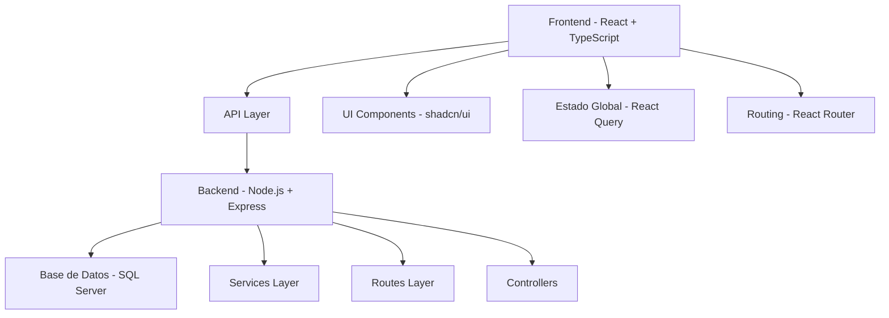

# 🚀 Ciberistas - Plataforma Educativa

> Una plataforma educativa moderna para jóvenes que desean aprender programación, robótica y tecnología de forma divertida e interactiva.

## 📋 Tabla de Contenidos

- [🎯 Características](#-características)
- [🏗️ Arquitectura del Proyecto](#️-arquitectura-del-proyecto)
- [⚡ Tecnologías Utilizadas](#-tecnologías-utilizadas)
- [🚀 Instalación y Configuración](#-instalación-y-configuración)
- [📁 Estructura del Proyecto](#-estructura-del-proyecto)
- [🎨 Diseño y UI/UX](#-diseño-y-uiux)
- [🔧 Scripts Disponibles](#-scripts-disponibles)
- [🌐 API Endpoints](#-api-endpoints)
- [📱 Responsive Design](#-responsive-design)
- [🔒 Seguridad](#-seguridad)
- [🧪 Testing](#-testing)
- [📈 Performance](#-performance)
- [🤝 Contribución](#-contribución)

## 🎯 Características

### ✨ Funcionalidades Principales

- **🎓 Gestión de Talleres**: Sistema completo para crear, editar y gestionar talleres educativos
- **👥 Registro de Participantes**: Formulario multi-paso intuitivo para inscripciones
- **📊 Dashboard Estadístico**: Métricas en tiempo real sobre participantes y talleres
- **🤝 Patrocinadores**: Sección dedicada a mostrar partners y colaboradores
- **📧 Sistema de Contacto**: Formularios de contacto integrados
- **🔄 API RESTful**: Backend robusto con endpoints bien documentados
- **📱 Responsive Design**: Diseño adaptativo para todos los dispositivos
- **🎨 UI Moderna**: Interfaz inspirada en las mejores prácticas de UX/UI

### 🌟 Destacados Técnicos

- **⚡ Performance Optimizada**: Lazy loading, code splitting y optimización de bundles
- **🔒 Seguridad Integrada**: Validación de formularios, sanitización de datos
- **♿ Accesibilidad**: Cumple con estándares WCAG 2.1
- **🌐 SEO Optimizado**: Meta tags, structured data y sitemap
- **📊 Analytics Ready**: Preparado para integración con Google Analytics

## 🏗️ Arquitectura del Proyecto

## ⚡ Tecnologías Utilizadas

### Frontend
- **React 18.3.1** - Biblioteca de UI moderna
- **TypeScript 5.5.3** - Tipado estático para JavaScript
- **Vite** - Build tool ultra-rápido
- **Tailwind CSS 3.4.11** - Framework CSS utility-first
- **shadcn/ui** - Componentes de UI elegantes y accesibles
- **React Query** - Gestión de estado del servidor
- **React Router DOM** - Enrutamiento del lado del cliente
- **React Hook Form** - Gestión eficiente de formularios
- **Zod** - Validación de esquemas TypeScript-first

### Backend
- **Node.js** - Runtime de JavaScript
- **Express.js 5.1.0** - Framework web minimalista
- **SQL Server** - Base de datos relacional
- **CORS** - Cross-Origin Resource Sharing
- **Body Parser** - Middleware para parsing de requests

### Desarrollo y Herramientas
- **ESLint** - Linting de código
- **Prettier** - Formateo de código
- **Concurrently** - Ejecución paralela de scripts
- **PostCSS** - Procesamiento de CSS
- **Autoprefixer** - Prefijos CSS automáticos

## What technologies are used for this project?

This project is built with:

- Vite
- TypeScript
- React
- shadcn-ui
- Tailwind CSS

## How can I deploy this project?

This project can be deployed using various methods:

### Frontend Deployment
- Build the frontend: `npm run build` in the frontend directory
- Deploy to services like Vercel, Netlify, or GitHub Pages
- Or serve with any static hosting service

### Backend Deployment
- Deploy the Node.js backend to services like Railway, Heroku, or DigitalOcean
- Or deploy the .NET API to Azure, AWS, or similar cloud services
- Make sure to update the API endpoints in the frontend configuration

## Custom Domain Setup

For custom domains, configure your hosting provider's domain settings according to their documentation.
